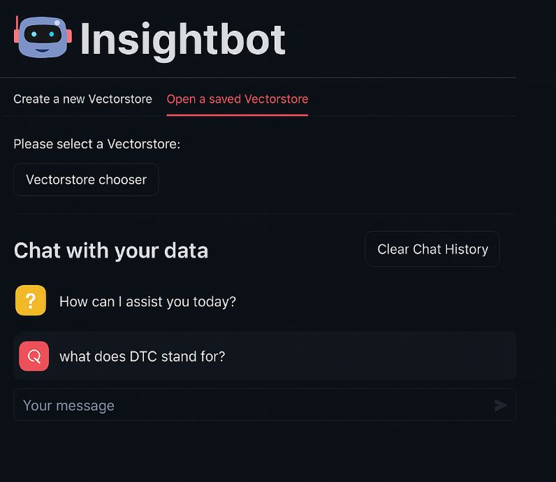
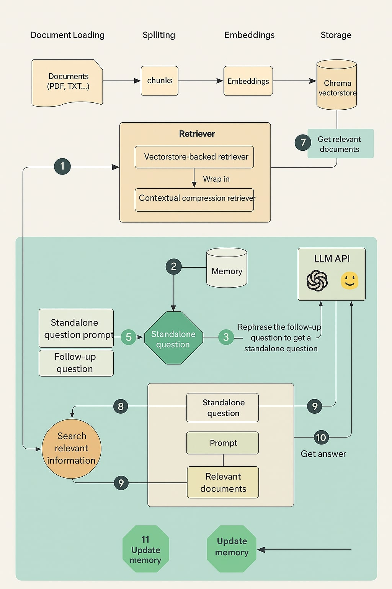

# Insightbot
Insightbot is a RAG chatbot built with LangChain, supporting OpenAI, Google Generative AI, and Hugging Face APIs. Upload documents (txt, pdf, CSV, docx) and chat with your data. Insightbot retrieves relevant content and augments LLM responses for accurate, up-to-date answers, all via an intuitive Streamlit UI

Project Overview
Large Language Models (LLMs) are powerful tools for generating creative and insightful content, but since they are trained on static datasets, their responses can sometimes be outdated or inaccurate. Retrieval-Augmented Generation (RAG) systems address this limitation by connecting LLMs to external data sources, enabling more accurate and up-to-date answers.

Insightbot is a RAG chatbot built using LangChain. It supports OpenAI, Google Generative AI, and Hugging Face APIs. Users can upload documents in .txt, .pdf, .csv, or .docx formats and interactively chat with their data. The system retrieves relevant documents and sends them to the selected LLM, ensuring that responses are grounded in your specific content.

Throughout this project, every component of the RAG pipeline is explored—from document ingestion to the conversational retrieval chain. The user interface is developed using Streamlit for an intuitive chat experience.

Features
Upload and chat with your own documents (TXT, PDF, CSV, DOCX)

Choose from multiple LLM providers: OpenAI, Google Generative AI, Hugging Face

Select specific models (e.g., GPT-3.5, GPT-4, Gemini-pro, Mistral-7B-Instruct-v0.2)

Adjustable model parameters and easy API key management

ChromaDB-powered vector storage for efficient document retrieval

Streamlit-based user interface

Installation
Requirements:

Python 3.x

Python libraries:

langchain

langchain-openai

langchain-google-genai

chromadb

streamlit

The complete list is available in requirements.txt.

Select the LLM provider (OpenAI, Google Generative AI, or Hugging Face)

Choose your preferred model (e.g., GPT-3.5, GPT-4, Gemini-pro, Mistral-7B-Instruct-v0.2)

Adjust model parameters as needed

Enter your API keys

Create or load a Chroma vectorstore.

Upload documents and start chatting:
Ask questions about your documents and receive AI-powered answers grounded in your data.

About
Insightbot is a retrieval-augmented chatbot designed for accurate, document-grounded conversations, leveraging the latest LLMs and retrieval technologies.

